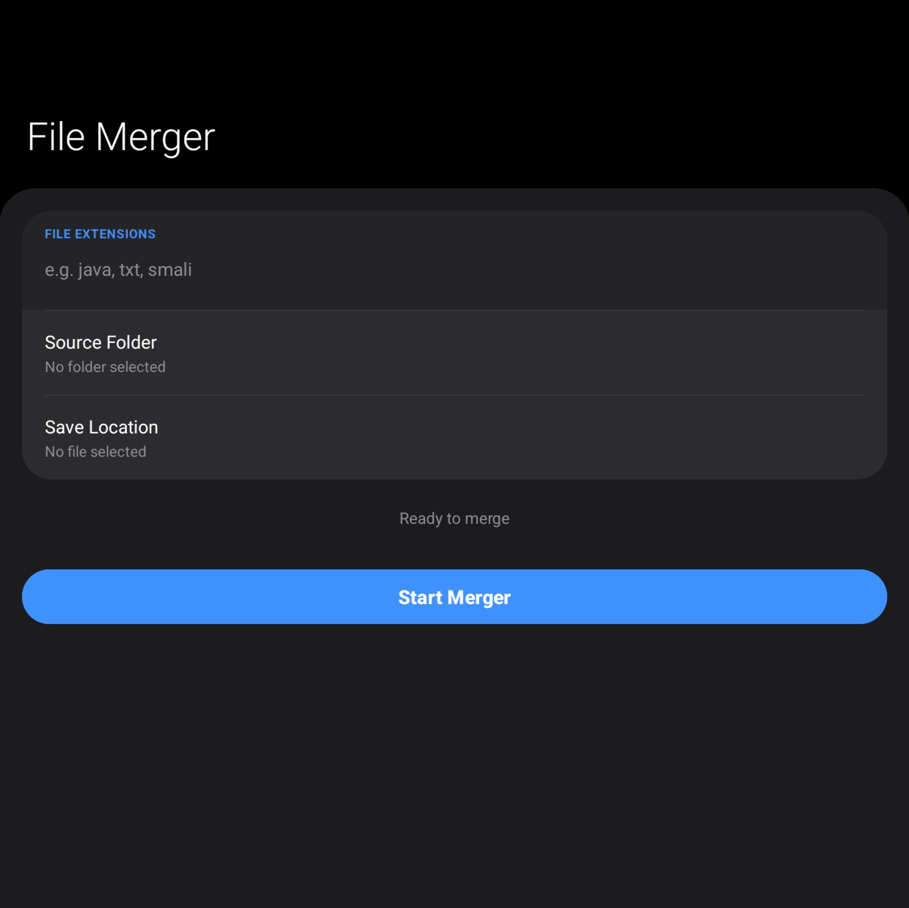
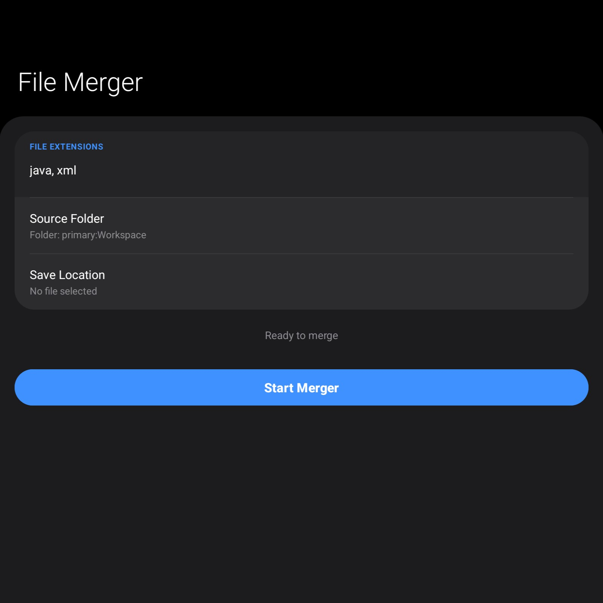

# File Merger
> **A simple, smooth tool to turn messy project folders into single, clean documents.**

---

## 📌 What is this?
**File Merger** is a straightforward Android app that takes a folder full of files (like your code project) and merges them all into one big text file. 

Whether you need to share your whole project with an AI, do a quick code review, or just keep a backup, this app does it with a "One UI" look that feels native to your Samsung or Android device.

---

## ✨ The Vibe
* **Immersive Dark Mode:** No grey or navy—just pure, deep black. 
* **Easy to Reach:** You don't have to stretch your thumb to the top of the screen; everything important is at the bottom.
* **Clean Output:** Every file in the merged document gets a clear "Header" so you know exactly where that code came from.

---

## 🛠 Tech Stack (The Simple Version)
* **Java 17:** Built with the latest, stable version of Java.
* **Modern Android:** Uses the newest Material 3 components for that fresh look.
* **Background Processing:** It works in the background so your phone doesn't freeze while merging big folders.

---

## 📸 See it in Action

  
  

---

## 🚀 How to Build it
1.  **Clone it:** `git clone https://github.com/RaviHalajole/filemerger.git`
2.  **Open it:** Use **AndroidIDE** or **Android Studio**.
3.  **Run it:** Just hit the Play button. It's already configured and ready to go.

---

## 📖 Technical Bits
If you are a developer and want to see how the file logic works, check out the `FileProcessor.java` file. It uses a recursive method to make sure it finds every file hidden in your sub-folders.

---

## ⚖️ License
This project is under the **MIT License**. Use it, change it, or share it—just have fun with it.

---
**Crafted by Ravi** • [Check out my other projcts](https://github.com/RaviHalajole)
